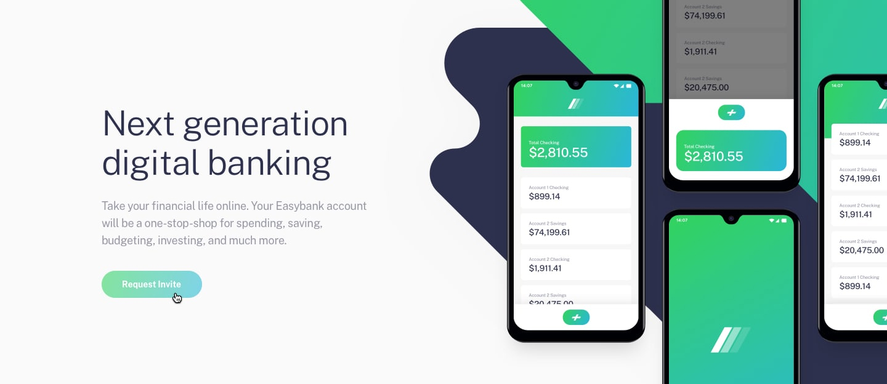

# Frontend Mentor - Easybank landing page solution

This is a solution to the [Easybank landing page challenge on Frontend Mentor](https://www.frontendmentor.io/challenges/easybank-landing-page-WaUhkoDN). 

## Overview

### The challenge

In this challenge, a responsive landing page was built for the fictional company easybank.
This was the first project I started to develop mobile first, and it was an extremely pleasant experience. In the rest, the project is a landing page, where I added some animations, so that the project would not be static and I made some adaptations for better responsiveness.

### Links

- Solution URL: [Repo Github](https://github.com/gustavosorati/frontendmentor-challenge-easybank-landing-page)
- Live Site URL: [Add live site URL here](https://your-live-site-url.com)

